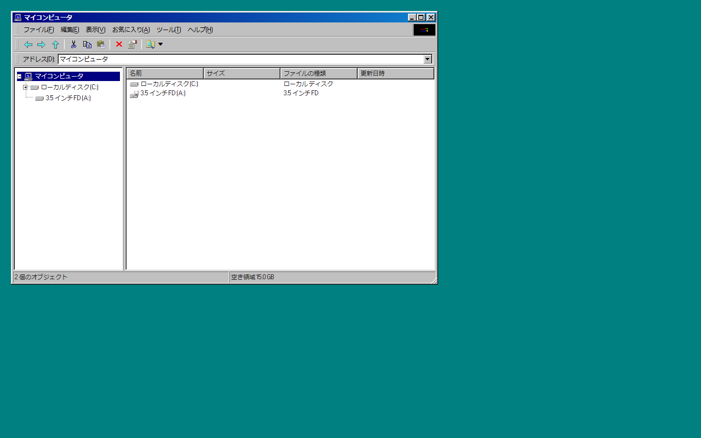

# react98retro


React で Windows 98 のコンポーネントを実装しました。

98.css をベースに React コンポーネントライブラリを構築し、ドラッグ・リサイズ可能なウィンドウ上で Windows 98 風のファイルエクスプローラーを動作させることを目標としたプロジェクトです。

🌐 **<a href="https://megablacklabel.github.io/react98retro/" target="_blank">デモを見る → https://megablacklabel.github.io/react98retro/</a>**

## スクリーンショット



## 実装コンポーネント

- **Window** — タイトルバー付き、ドラッグ移動・リサイズ対応ウィンドウ
- **MenuBar** — プルダウンメニュー付きメニューバー
- **Toolbar** — アイコン＋ラベル付きツールバー（SplitButton 対応）
- **AddressBar** — アドレスバー（ドロップダウン履歴付き）
- **TreeView** — フォルダツリー
- **TableView** — 列リサイズ対応ファイル一覧テーブル
- **SplitButton** — アイコン＋▼ボタン＋メニューの複合ボタン
- **Menu** — ネスト対応コンテキストメニュー
- **Button / CheckBox / Radio / TextBox / TextArea / GroupBox** など、98.css の全 UI コンポーネント

## 技術スタック

| 項目 | 内容 |
|------|------|
| フレームワーク | React 19 + TypeScript |
| ビルドツール | Vite 8 |
| ランタイム | Bun |
| スタイル | 98.css |
| アイコン | Chicago95（jsDelivr CDN 経由で動的取得） |
| フォント | Pixelated MS Sans Serif / DotGothic16 |
| コンポーネントカタログ | Storybook |
| テスト | Vitest |

## 開発環境の起動

```bash
# 開発サーバー起動
bun run dev

# Storybook 起動
bun run storybook

# テスト実行
bun run test

# ビルド（デモアプリ）
bun run build

# ビルド（ライブラリ）
bun run build:lib
```

## パッケージとして使う

このライブラリは [GitHub Packages](https://github.com/MegaBlackLabel/react98retro/packages) として公開されています。

### 1. `.npmrc` にレジストリを追加

プロジェクトルートの `.npmrc` に以下を追記してください。

```
@megablacklabel:registry=https://npm.pkg.github.com
```

### 2. インストール

```bash
npm install @megablacklabel/react98retro
# または
bun add @megablacklabel/react98retro
```

### 3. 使い方

```tsx
import { Window, Button, MenuBar } from '@megablacklabel/react98retro';
import '@megablacklabel/react98retro/style.css';

function App() {
  return (
    <Window title="My App" width={400} height={300} initialX={50} initialY={50}>
      <p>Hello, Windows 98!</p>
      <Button>OK</Button>
    </Window>
  );
}
```

## アイコンについて

アイコンは [Chicago95](https://github.com/grassmunk/Chicago95) の SVG を
[jsDelivr CDN](https://www.jsdelivr.com/) 経由で動的に取得しています。

```
https://cdn.jsdelivr.net/gh/grassmunk/Chicago95@master/Icons/Chicago95/...
```

ローカルにアイコンファイルをバンドルしていないため、インターネット接続が必要です。

## ライセンス表記

このプロジェクトのソースコードは **MIT License** で配布されています。

---

### 98.css

**Copyright (c) 2020 Jordan Scales**
License: **MIT**
Repository: https://github.com/jdan/98.css

---

### Chicago95 Icons（実行時に CDN から取得）

**Copyright (c) 2019-2024 grassmunk**
License: **GNU General Public License v3.0 (GPL-3.0)**
Repository: https://github.com/grassmunk/Chicago95

> アイコンはローカルにバンドルせず、実行時に jsDelivr CDN 経由で取得します。
> Chicago95 アイコン自体の利用は GPL-3.0 に従います。

---

### DotGothic16

**Copyright (c) 2020 Fontworks Inc.**
License: **SIL Open Font License 1.1 (OFL-1.1)**
Google Fonts: https://fonts.google.com/specimen/DotGothic16
